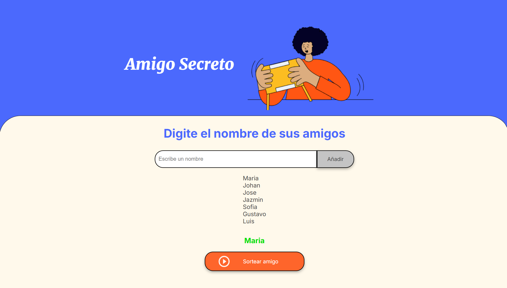

## Título e imagen de portada

<h1 align="center"> Challenge Amigo secreto </h1>

## Índice

\*[Título e imagen de portada](#Título-e-imagen-de-portada)

\*[Índice](#índice)

\*[Descripción del proyecto](#descripción-del-proyecto)

\*[Características de la aplicación y demostración](#Características-de-la-aplicación-y-demostración)

\*[Acceso al proyecto](#acceso-proyecto)

\*[Tecnologías utilizadas](#tecnologías-utilizadas)

\*[Personas-Desarrolladores del Proyecto](#Autores)

## Descripción del proyecto

El desafío "Amigo secreto" está diseñado para poder aplicar de manera práctica los conocimientos adquiridos en varios cursos de Alura Latam en colaboración con Oracle y su programa de educación ONE. Este reto permite trabajar conla lógica de programación, funciones y listas, además de optimizar los resultados utilizando herramientas como los son Git/GitHub para el manejo de versiones.

En este desafío, se creo un programa que simula el juego del amigo secreto, donde los participantes se asignan entre sí de manera aleatoria.

## Características de la aplicación y demostración

* Asignación Aleatoria: El programa es capaz de asignar a cada participante un amigo secreto de manera aleatoria.
* Interfaz de Usuario: Cuenta con una interfaz simple donde los usuarios ingresen sus nombres y vean quién les ha tocado como amigo secreto.

* Uso de Funciones: Implementa funciones para manejar la lógica de asignación, así como para mostrar los resultados.
* Manejo de Listas: Utiliza listas para almacenar los nombres de los participantes y para gestionar las asignaciones.
* Persistencia de Datos: El proyecto utiliza Git/GitHub, lo que permite llevar un control de las versiones del proyecto.

## Acceso proyecto

Para utilizar el juego solo se necesita clonar este repositorio o descargar el proyecto el .zip
Una vez echo el paso anterior solo necesitaras abril el archivo index.html y listo ya podras jugar!

## Tecnologías utilizadas

 <table>
      <tr>
        <td align="center" width="95">
            
             JavaScript
        </td>
         <td align="center" width="95">
            
             HTML5
        </td>
         <td align="center" width="95">
            
             CSS
        </td>
      </tr>
 </table>

## Autores

[ Alex Garcia](https://github.com/Alex-Gar)
